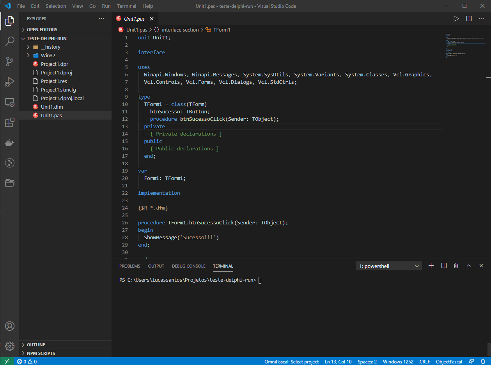

# delphi-run
Usando linha de comando para compilar e executar projeto Delphi.

## Instalação
Copie o arquivo `delphi-run.bat` para sua pasta `C:\Windows\System32` e pronto.

## Execução

Para executar utilize o seguinte comando `delphi-run` no powershell ou cmd dentro da pasta do seu projeto e seja feliz.

## Observação
Dependendo da sua versão do delphi terá que alterar a linha 2 do script para a versão que você usa, por exemplo para o Berlin o comando é `call "C:\Program Files (x86)\Embarcadero\Studio\18.0\bin\rsvars.bat"`

